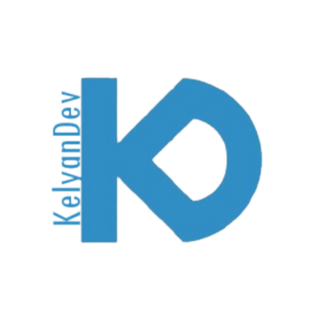

[![Contributors][contributors-shield]][contributors-url]
[![Forks][forks-shield]][forks-url]
[![Stargazers][stars-shield]][stars-url]
[![Issues][issues-shield]][issues-url]
<!--[![MIT License][license-shield]][license-url]
[![LinkedIn][linkedin-shield]][linkedin-url] -->

<!-- PROJECT LOGO -->
 

  

<h3 align="center">Portfolio</h3>

  

    My personal Portfolio, regrouping all information regarding my skills as well as my projects.
     
    <a href="https://github.com/KelyanDev/Portfolio"><strong>Explore the docs »</strong></a>
     
     
    <a href="https://github.com/KelyanDev/Portfolio">View Demo</a>
    ·
    <a href="https://github.com/KelyanDev/Portfolio/issues/new?labels=bug&template=bug-report---.md">Report Bug</a>
    ·
    <a href="https://github.com/KelyanDev/Portfolio/issues/new?labels=enhancement&template=feature-request---.md">Request Feature</a>
  

<!-- TABLE OF CONTENTS -->

  
Table of Contents

  <ol>
    <li>
      <a href="#about-the-project">About The Project</a>
      <ul>
        <li><a href="#built-with">Built With</a></li>
      </ul>
    </li>
    <!--<li>
      <a href="#getting-started">Getting Started</a>
      <ul>
        <li><a href="#prerequisites">Prerequisites</a></li>
        <li><a href="#installation">Installation</a></li>
      </ul>
    </li>-->
    <li><a href="#usage">Usage</a></li>
    <li><a href="#roadmap">Roadmap</a></li>
    <!--<li><a href="#contributing">Contributing</a></li>
    <li><a href="#license">License</a></li>-->
    <li><a href="#contact">Contact</a></li>
    <!--<li><a href="#acknowledgments">Acknowledgments</a></li>-->
  </ol>

<!-- ABOUT THE PROJECT -->
## About The Project

My Portfolio is a React web site designed as a way of showcasing my skills in programming as well as networks and telecommunications. It provides a user-friendly website for anyone looking to get more information about my education, my work and my projects.   

(<a href="#readme-top">back to top</a>)

### Built With

* [![React][React.dev]][React-url]
* [![NodeJS][NodeJS.com]][NodeJS-url]
* [![ReactRouter][ReactRouter.com]][ReactRoute-url]
* [![CSS][CSS.com]][CSS-url]
* [![Javascript][JS.com]][JS-url]

(<a href="#readme-top">back to top</a>)

<!-- USAGE EXAMPLES -->
## Usage

To check my portfolio, you can simply go on https://kelyandev.github.io/Portfolio.   

Once on my portfolio, you can simply check the sections that interest you the most. The website's language is French by default, but you can change it to English at the bottom of the sidebar, on the left of the site.
To extend the sidebar, you can simply press on the arrow-like button on the top of it. 
The sidebar is organized in two different parts: the navigation part, used to change rapidly the section you're on, and the parameter part, used to change the language or change the color theme.

This is all you know to explore my website freely. Don't hesitate to give me feedback if you think something is off.

<!-- _For more examples, please refer to the [Documentation](https://example.com)_ -->

(<a href="#readme-top">back to top</a>)

<!-- ROADMAP -->
## Roadmap

- [x] Network-like project map
- [ ] Adaptivity

See the [open issues](https://github.com/KelyanDev/Portfolio/issues) for a full list of proposed features (and known issues).

(<a href="#readme-top">back to top</a>)

<!-- CONTACT -->
## Contact

My Portfolio - [Click here](https://kelyandev.github.io/Portfolio)

Project Link: [https://github.com/KelyanDev/Portfolio](https://github.com/KelyanDev/Portfolio)

(<a href="#readme-top">back to top</a>)

<!-- MARKDOWN LINKS & IMAGES -->
<!-- https://www.markdownguide.org/basic-syntax/#reference-style-links -->
[contributors-shield]: https://img.shields.io/github/contributors/KelyanDev/Portfolio.svg?style=for-the-badge
[contributors-url]: https://github.com/KelyanDev/Portfolio/graphs/contributors
[forks-shield]: https://img.shields.io/github/forks/KelyanDev/Portfolio.svg?style=for-the-badge
[forks-url]: https://github.com/KelyanDev/Portfolio/network/members
[stars-shield]: https://img.shields.io/github/stars/KelyanDev/Portfolio.svg?style=for-the-badge
[stars-url]: https://github.com/KelyanDev/Portfolio/stargazers
[issues-shield]: https://img.shields.io/github/issues/KelyanDev/Portfolio.svg?style=for-the-badge
[issues-url]: https://github.com/KelyanDev/Portfolio/issues
[license-shield]: https://img.shields.io/github/license/KelyanDev/Portfolio.svg?style=for-the-badge
[license-url]: https://github.com/KelyanDev/Portfolio/blob/master/LICENSE.txt
[linkedin-shield]: https://img.shields.io/badge/-LinkedIn-black.svg?style=for-the-badge&logo=linkedin&colorB=555
[linkedin-url]: https://linkedin.com/in/linkedin_username

[React.dev]: https://img.shields.io/badge/React-20232A?style=for-the-badge&logo=react&logoColor=61DAFB
[React-url]: [https://reactjs.org/](https://react.dev/learn)
[NodeJS.com]: https://img.shields.io/badge/Node%20js-339933?style=for-the-badge&logo=nodedotjs&logoColor=white
[NodeJS-url]: 
[ReactRouter.com]: https://img.shields.io/badge/React_Router-CA4245?style=for-the-badge&logo=react-router&logoColor=white
[ReactRoute-url]: [https://reactjs.org/](https://reactrouter.com/en/main)
[CSS.com]: https://img.shields.io/badge/CSS3-1572B6?style=for-the-badge&logo=css3&logoColor=white
[CSS-url]: 
[JS.com]: https://img.shields.io/badge/JavaScript-323330?style=for-the-badge&logo=javascript&logoColor=F7DF1E
[JS-url]: 
